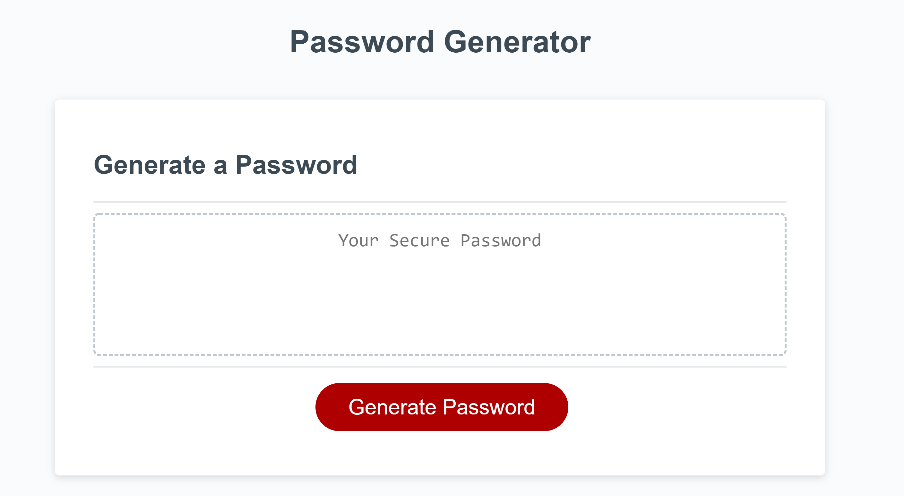
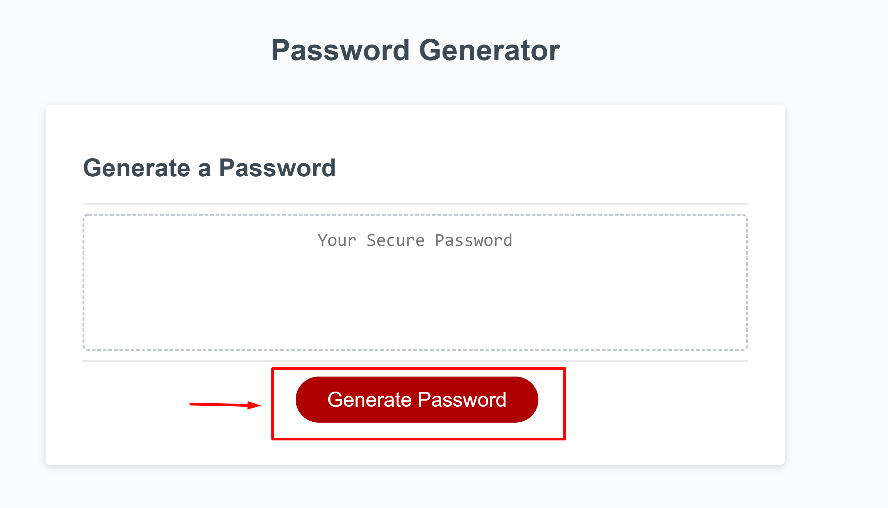
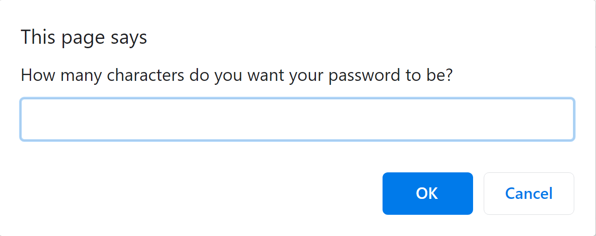
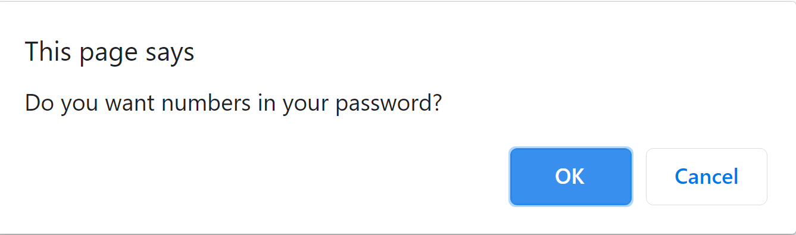
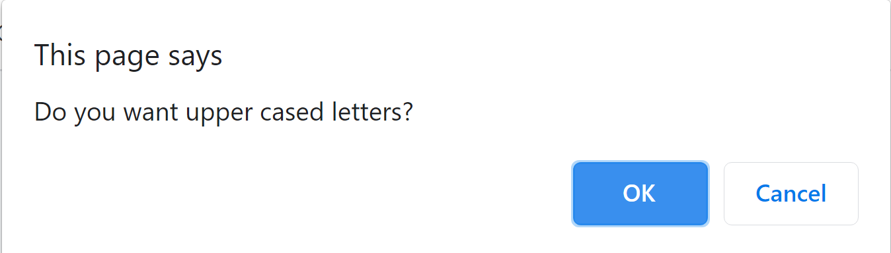
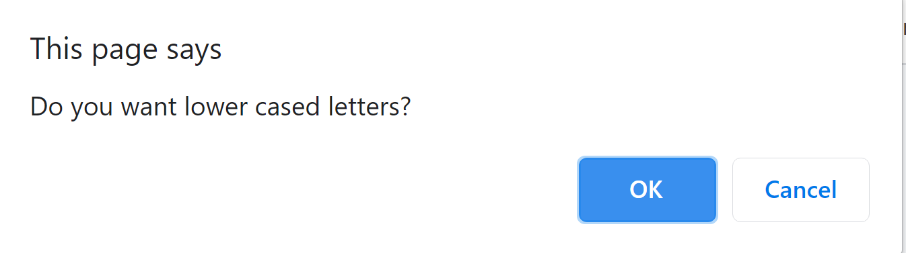
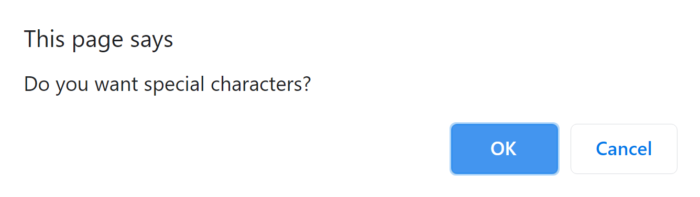

# Password Generator

## Description 

This application was created in order to make dynamic and secure passwords based on the preferences of the user. Passwords created can be anywhere from 8 to 128 characters, with the option to include some or all of the following: Upper Cased Characters, Lower Cased Characters, Special Characters, or Numbers.

## Usage 

Steps to use the Password Generator:
1) Click "Generate Password" button

2) When asked for password Length, type a numerical number between 8 & 128. Anything else will not be accepted

3) If you would like numerical numbers in your password, click OK. If you do not, click Cancel

4) If you would like Upper Cased letters in your password, click OK. If you do not, click Cancel

5) If you would like Lower Cased letters in your password, click OK. If you do not, click Cancel

6) If you would like Special letters in your password, click OK. If you do not, click Cancel

## Credits

Collaborated with Ebuka to convert the Array to a String

## License

None needed

---
